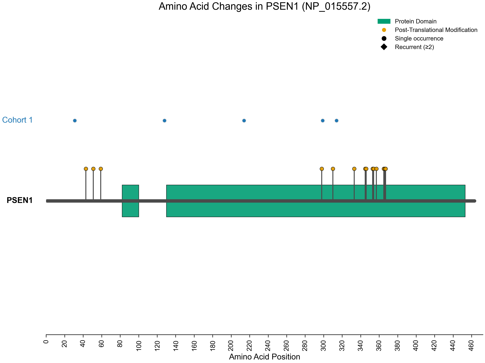
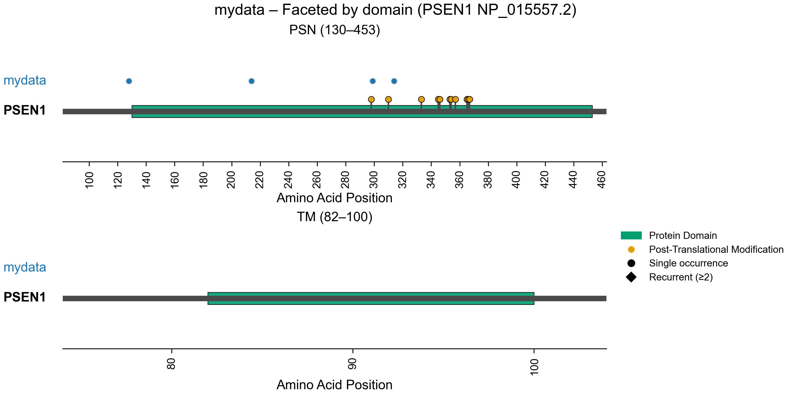

# plot-protein

**Plot Protein: Visualization of Mutations**

**version 4.0.0**

Tychele N. Turner, Ph.D.

---

## Overview

Plot Protein visualizes amino acid changes along a protein, drawing variants above a schematic and overlaying domains and post-translational modifications. It supports zooming into regions of interest, customizing axis tick sizes, labels, and more.

> [!NOTE]
> - **Use the Python implementation (recommended)** – more options, actively extended, pip-installable.
> - **R implementation** – original script and Snakemake workflow, kept for compatibility and existing pipelines.

> [!NOTE]
> Please cite this paper if using this tool: Turner T. Plot protein: visualization of mutations. J Clin Bioinforma. 2013 Jul 22;3(1):14. doi: 10.1186/2043-9113-3-14. PMID: 23876180; PMCID: PMC3724591.

## Input formats

These formats are used across implementations.

### Mutation file (basic)

Tab-delimited file with **5 columns, no header** (the Python implementation allows for two extra columns including annotation and score):
```
ProteinId
GeneName
ProteinPositionOfMutation
ReferenceAminoAcid
AlternateAminoAcid
Annotation (optional in Python only)
Score (optional in Python only)
```

### Protein architecture file
Tab-delimited file with a **header** and **3 columns**:
```
architecture_name
start_site
end_site
```

### Post-translational modification file
Tab-delimited file with **one column** (with header):
```
site
```

---

## Python implementation (recommended)

### Installation
```
git clone https://github.com/tycheleturner/plot-protein.git
cd plot-protein/plot_protein_py/
pip install .
```

#### Command-line usage
Basic example:
```
plot-protein \
-m psen1_mutation_file.txt \
-a psen1_architecture_file.txt \
-p psen1_post_translation_file.txt \
-l 463 \
-o psen1_plot.pdf
```

Output:



Example with more options:
```
plot-protein \
-m psen1_mutation_file.txt \
-a psen1_architecture_file.txt \
-p psen1_post_translation_file.txt \
-l 463 \
-o psen1_plot_domains.pdf \
--mutations-name mydata \
--facet-domains \
--name mydata
```

Output:



Full Option List (Python CLI):
```
usage: plot_protein [-h] [-m MUTATIONS] [--mutations_bottom MUTATIONS_BOTTOM] [--mutations-name MUTATIONS_NAME] [--mutations-bottom-name MUTATIONS_BOTTOM_NAME] [-a ARCHITECTURE] [-p POSTTRANSLATIONAL]
                    [-l LENGTH] [-n NAME] [-t TICKSIZE] [-s {yes,no}] [-z {yes,no}] [-b ZOOMSTART] [-c ZOOMEND] [-o OUTPUT] [--format {pdf,png,svg}] [--hide-architecture] [--hide-ptms]
                    [--facet-domains] [--color-by {auto,annotation,score,cohort}] [--include-annotations INCLUDE_ANNOTATIONS [INCLUDE_ANNOTATIONS ...]] [--min-score MIN_SCORE] [--theme {light,dark}]
                    [--palette {default,colorblind}] [--dpi DPI] [--jitter {auto,off}] [--jitter-window JITTER_WINDOW] [--jitter-amplitude JITTER_AMPLITUDE] [--grid] [--point-size POINT_SIZE]
                    [--title TITLE] [--annotation-colors-out ANNOTATION_COLORS_OUT] [--score-colors-out SCORE_COLORS_OUT] [--architecture-labels {yes,no}] [--version]

Plot protein mutations, domains, and post-translational modifications.

options:
  -h, --help            show this help message and exit
  -m, --mutations MUTATIONS
                        Primary (top) cohort mutation file. Whitespace-delimited (tabs and/or spaces), 5/6/7 cols: ProteinId, GeneName, ProteinPositionOfMutation, ReferenceAminoAcid,
                        AlternateAminoAcid[, Annotation[, Score]]. NO HEADER.
  --mutations_bottom, -m2 MUTATIONS_BOTTOM
                        Optional bottom cohort mutation file. Same format as --mutations. If provided, this cohort is plotted below the protein line.
  --mutations-name MUTATIONS_NAME
                        Label for the primary/top mutation group. Default: 'Cohort 1'.
  --mutations-bottom-name MUTATIONS_BOTTOM_NAME
                        Label for the bottom mutation group (if provided). Default: 'Cohort 2'.
  -a, --architecture ARCHITECTURE
                        Optional protein architecture file. Tab-delimited, 3 columns with header: architecture_name, start_site, end_site. If omitted, domains are not drawn (and faceting is disabled).
  -p, --posttranslational POSTTRANSLATIONAL
                        Optional post-translational modification file. Tab-delimited, one column 'site' with header. If omitted, PTM sites are not drawn.
  -l, --length LENGTH   Protein length (REQUIRED).
  -n, --name NAME       Name of your query/study. Default: 'Test'.
  -t, --ticksize TICKSIZE
                        Size of ticks on x-axis. This is dynamic with protein size but can be set by the user. Default: 10.
  -s, --showlabels {yes,no}
                        Option to show mutation labels (yes/no). Default: no.
  -z, --zoom {yes,no}   Option to zoom in somewhere in the protein (yes/no). Default: no.
  -b, --zoomstart ZOOMSTART
                        Starting AA position for zoom. Used if --zoom yes. Default: 1.
  -c, --zoomend ZOOMEND
                        Ending AA position for zoom. Used if --zoom yes. Default: 10.
  -o, --output OUTPUT   Output filename. If it has .pdf/.png/.svg, that determines format. Otherwise the extension is added based on --format / default.
  --format {pdf,png,svg}
                        Output format: pdf, png, or svg. Default: infer from --output or 'pdf'.
  --hide-architecture   Hide protein architecture domains.
  --hide-ptms           Hide post-translational modification sites.
  --facet-domains       Facet by domain region from the architecture file (one panel per domain).
  --color-by {auto,annotation,score,cohort}
                        How to color mutation points: 'auto' (default: use Annotation if present, else by cohort), 'annotation', 'score' (requires Score column), or 'cohort'.
  --include-annotations INCLUDE_ANNOTATIONS [INCLUDE_ANNOTATIONS ...]
                        Only plot mutations whose Annotation is in this list (e.g. damaging LoF missense).
  --min-score MIN_SCORE
                        Only plot mutations with Score >= this value.
  --theme {light,dark}  Plot theme: "light" (default) or "dark".
  --palette {default,colorblind}
                        Color palette: "default" or "colorblind".
  --dpi DPI             DPI for raster outputs (PNG). Default: 300.
  --jitter {auto,off}   Vertical jitter for nearby mutations: 'auto' (default) or 'off'. This is helpful when mutations are very close to each other.
  --jitter-window JITTER_WINDOW
                        Window (AA) within which mutations are considered 'nearby' for jitter (default: 5).
  --jitter-amplitude JITTER_AMPLITUDE
                        Maximum vertical jitter offset (default: 0.005).
  --grid                Show light vertical grid lines on the x-axis.
  --point-size POINT_SIZE
                        Base point size for mutation markers (default: 30).
  --title TITLE         Override main plot title. If not set, a gene/protein-based title is used by default.
  --annotation-colors-out ANNOTATION_COLORS_OUT
                        Optional TSV to write Annotation -> color mapping when annotation-based colors are used.
  --score-colors-out SCORE_COLORS_OUT
                        Optional TSV to write Score colormap bins (score_min/max/color) when color mode is 'score'.
  --architecture-labels {yes,no}
                        Show text labels for domains on the main plot (default: no).
  --version             show program's version number and exit
```

## R implementation (compatibility)
The original implementation is kept for users with existing R workflows.

#### Command-line usage
Basic example:
```
Rscript plotProtein.R \
-m psen1_mutation_file.txt \
-a psen1_architecture_file.txt \
-p psen1_post_translation_file.txt \
-l 463
```

Example with more options:
```
Rscript plotProtein.R \
-m psen1_mutation_file.txt \
-a psen1_architecture_file.txt \
-p psen1_post_translation_file.txt \
-l 464 \
-n Disease \
-t 25 \
-s yes \
-z yes \
-b 50 \
-c 100
```

Full Options (R script):
```
Usage: plotProtein.R [options]


Options:
	-m MUTATIONS, --mutations=MUTATIONS
		This is the mutation file. It should be a tab-delimited file containing 5 columns (ProteinId, GeneName, ProteinPositionOfMutation, ReferenceAminoAcid, AlternateAminoAcid) NO HEADER FOR NEEDED FOR THIS FILE. (REQUIRED)

	-a ARCHITECTURE, --architecture=ARCHITECTURE
		This is the protein architecture file. It should be a tab-delimited file containing 3 columns (architecture_name, start_site, end_site). This file NEEDS the header and it is the same as what was previously written. This information can be downloaded from the HPRD (http://hprd.org/). Although the most recent files are quite old so looking in the web browser you can get much more up to date information. (REQUIRED)

	-p POSTTRANSLATIONAL, --posttranslational=POSTTRANSLATIONAL
		This is the protein post-translational modification file. This is a tab-delimited file with only one column and that is the site. This file NEEDS a header and is as previously written (site). (REQUIRED)

	-l LENGTH, --length=LENGTH
		protein length (REQUIRED)

	-n NAME, --name=NAME
		Name of your query. Default is Test

	-t TICKSIZE, --ticksize=TICKSIZE
		Size of ticks on x-axis. Default is 10

	-s SHOWLABELS, --showlabels=SHOWLABELS
		Option to show labels. Default is no

	-z ZOOM, --zoom=ZOOM
		Option to zoom in. Default is no

	-b ZOOMSTART, --zoomstart=ZOOMSTART
		Starting number for zoom in. Use if zoom option is set to yes. Default is 1

	-c ZOOMEND, --zoomend=ZOOMEND
		Ending number for zoom in. Use if zoom option is set to yes. Default is 10

	-h, --help
		Show this help message and exit
```

## High-throughput (R + Snakemake)
Currently implemented for the R version under high_throughput/.

Mutation file format:
```
Column 1: GENE_HUGO_ID (Can use NA if unavailable)
Column 2: PROTEIN_ID Required: Must match Protein Ids provided in the protein length file
Column 3: STUDY_NAME (Can use NA if unavailable)
Column 4: AMINO_ACID_POSITION Required: Amino Acid position of the variant
Column 5: CHROM (Can use NA if unavailable)
Column 6: POSITION (Can use NA if unavailable)
Column 7: REF Allele (Can use NA if unavailable)
Column 8: ALT Allele (Can use NA if unavailable)
Column 9: ALLELE_FREQUENCY Optional column. (Can use NA if unavailable) 
```

#### Generate list of proteins to plot:
```
cut -f2 <mutation_file> | sort | uniq > proteins_to_plot.txt
```

#### Get the repository:
```
git clone https://github.com/tycheleturner/plot-protein.git
cd plot-protein/high_throughput/
```

* Fill out the config file. You'll need a post-translational modification file and a domain file. These can be downloaded from HPRD or you could make your own. Required information is shown below.
** Post translational modification file has a column 4 with the protein id matching that of the mutation file and column 5 is the site.
** Domain file has a column 3 with the protein id matching that of the mutation file, column 5 with the domain name, column 7 is the starting amino acid of the domain, and column 8 is the ending amino acid of the domain


#### Run Snakemake:
```
snakemake
```

#### or on a cluster:
```
snakemake --cluster 'qsub {params.sge_opts}' -j 100 -w 30 -k
```

