# Example usage of plot-protein

### standard plot
```
plot-protein \
--mutations example_variants/PTEN_denovodb_version1.8_function.txt  \
-l 403 \
--architecture pten_architecture.txt \
--format png \
--output PTEN_standard.png
```
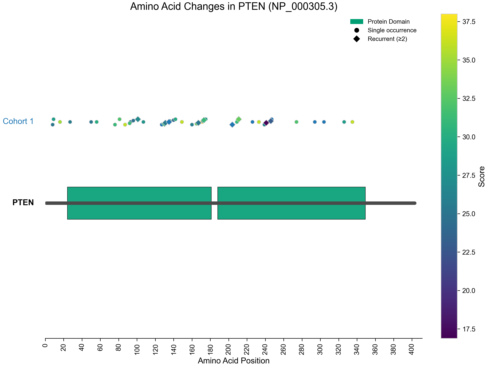

### standard plot (dark theme)
```
plot-protein \
--mutations example_variants/PTEN_denovodb_version1.8_function.txt  \
-l 403 \
--architecture pten_architecture.txt \
--format png \
--output PTEN_standard_dark.png \
--theme dark
```
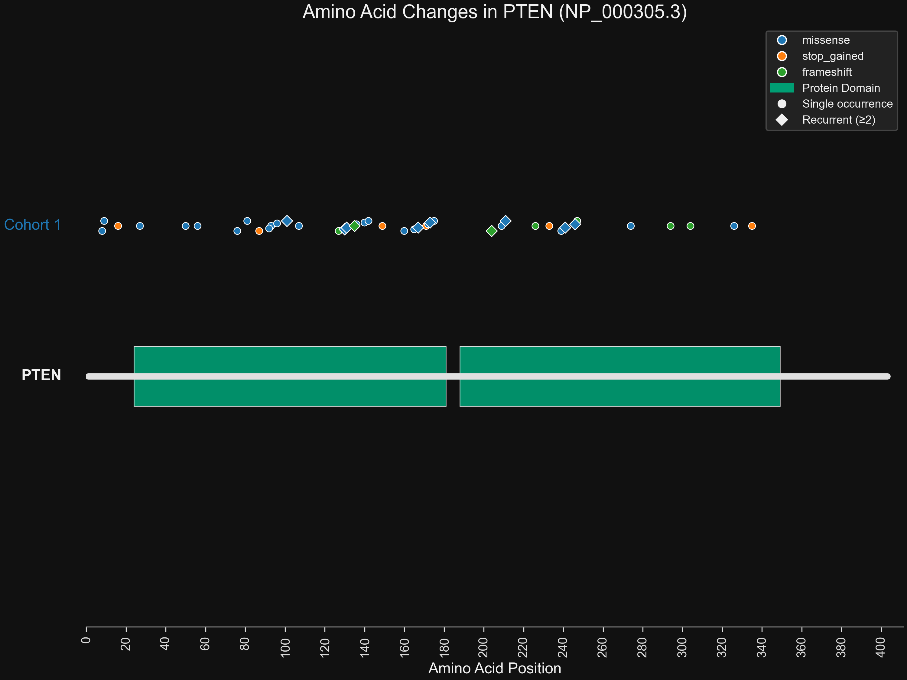

### standard (color by score column)
```
plot-protein \
--mutations example_variants/PTEN_denovodb_version1.8_function.txt  \
-l 403 \
--architecture pten_architecture.txt \
--format png \
--output PTEN_standard_score.png \
--color-by score
```


### standard (small point size) and includes ptms
```
plot-protein \
--mutations example_variants/PTEN_denovodb_version1.8_function.txt \
--mutations-name "Function" \
-l 403 \
--architecture pten_architecture.txt \
--format png \
--point-size 5  \
--jitter off \
--posttranslational pten_ptm.txt \
--output PTEN_standard_5_point.png
```
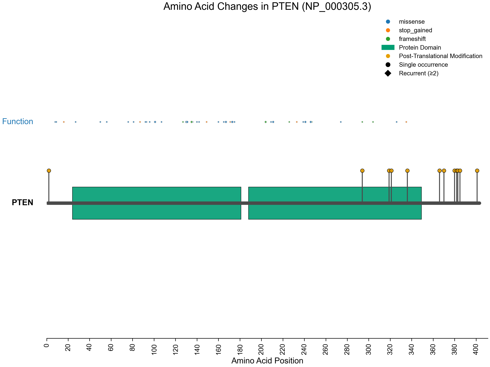

### standard (filter to keep only variants with score greater than 30)
```
plot-protein \
--mutations example_variants/PTEN_denovodb_version1.8_function.txt  \
-l 403 \
--architecture pten_architecture.txt \
--format png \
--output PTEN_standard_score_color_filter_score_30.png \
--color-by score \
--min-score 30
```
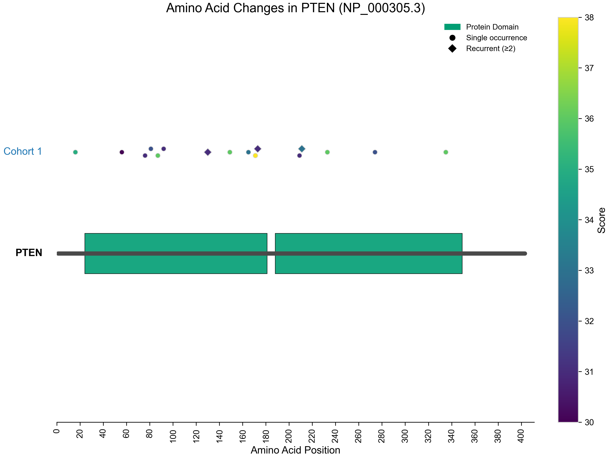

### standard (filter to keep only variants that are stop_gained)
```
plot-protein \
--mutations example_variants/PTEN_denovodb_version1.8_function.txt  \
-l 403 \
--architecture pten_architecture.txt \
--format png \
--output PTEN_standard_stop_gained.png \
--include-annotations stop_gained
```
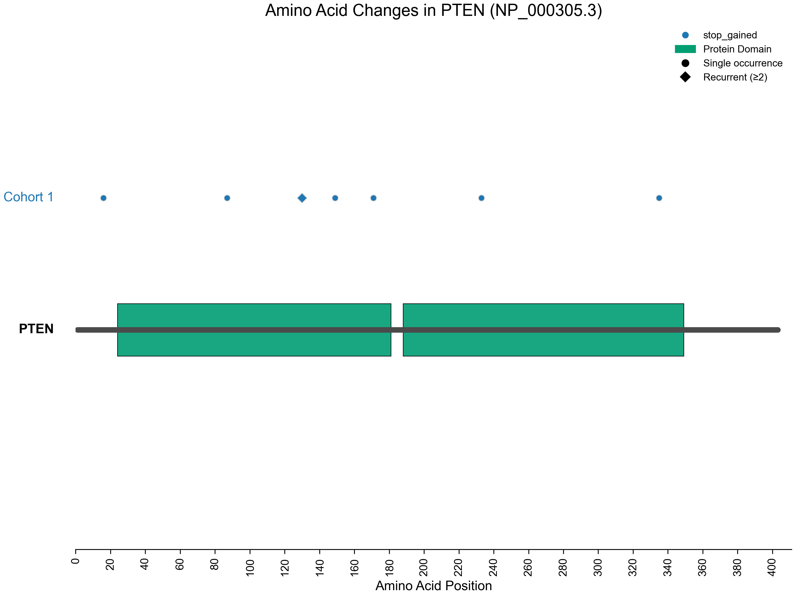

### standard (filter to keep only variants that are stop_gained), no jitter
```
plot-protein \
--mutations example_variants/PTEN_denovodb_version1.8_function.txt  \
-l 403 \
--jitter off \
--architecture pten_architecture.txt \
--format png \
--output PTEN_standard_stop_gained_no_jitter.png \
--include-annotations stop_gained
```


### standard (filter to keep only variants that are stop_gained), no jitter
```
plot-protein \
--mutations example_variants/PTEN_denovodb_version1.8_function.txt  \
-l 403 \
--jitter off \
--architecture pten_architecture.txt \
--format png \
--output PTEN_standard_stop_gained_no_jitter_show_labels.png \
--include-annotations stop_gained \
--showlabels yes
```
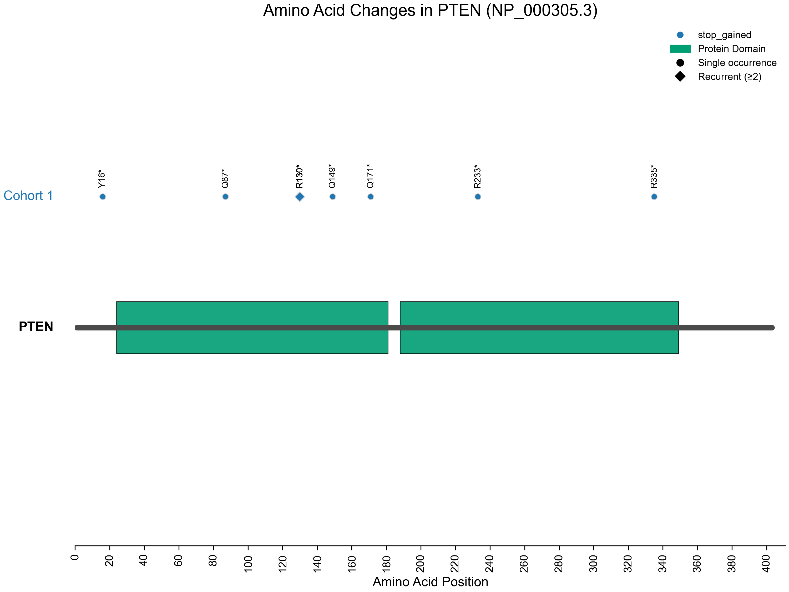

### focus on domains
```
plot-protein \
--mutations example_variants/PTEN_denovodb_version1.8_function.txt  \
-l 403 \
--architecture pten_architecture.txt \
--format png \
--output PTEN_jitter_facet_domain.png \
--facet-domain
```
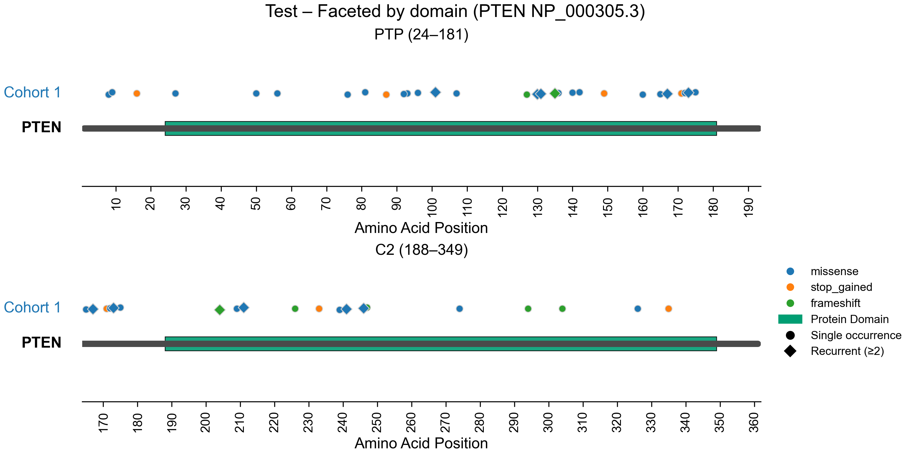

### focus on domains and color by score
```
plot-protein \
--mutations example_variants/PTEN_denovodb_version1.8_function.txt  \
-l 403 \
--architecture pten_architecture.txt \
--format png \
--output PTEN_jitter_standard_score_color_facet_domain.png \
--color-by score \
--facet-domain
```
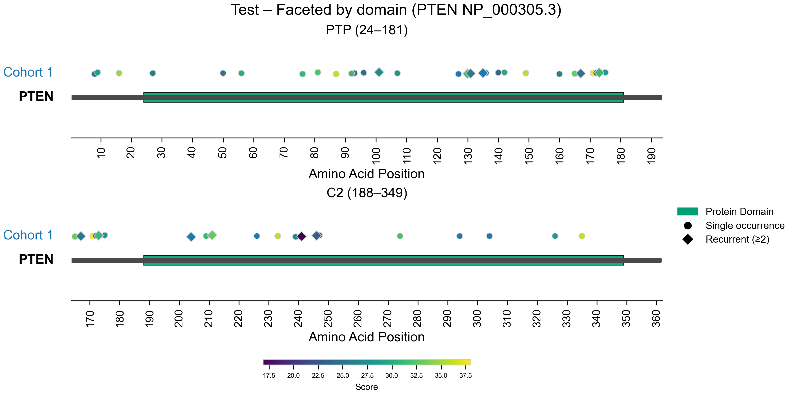

### focus on domains, add custom name to the plot, change up sizes
```
plot-protein \
--mutations example_variants/PTEN_denovodb_version1.8_phenotype.txt  \
-l 403 \
--architecture pten_architecture.txt \
--format png \
--output PTEN_jitter_more_facet_domain_phenotype.png \
--facet-domain \
--jitter-window 10 \
--jitter-amplitude 0.01 \
--point-size 10 \
--name mydata
```
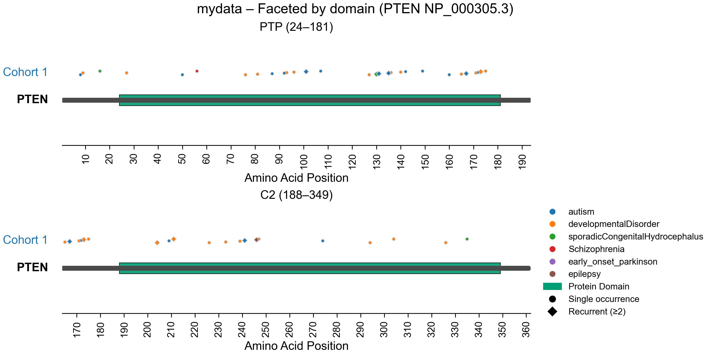

### focus on domains, add custom name to the plot, change up sizes, theme dark
```
plot-protein \
--mutations example_variants/PTEN_denovodb_version1.8_phenotype.txt  \
-l 403 \
--architecture pten_architecture.txt \
--format png \
--output PTEN_jitter_more_facet_domain_phenotype_dark.png \
--facet-domain \
--jitter-window 10 \
--jitter-amplitude 0.01 \
--point-size 10 \
--name mydata \
--theme dark
```
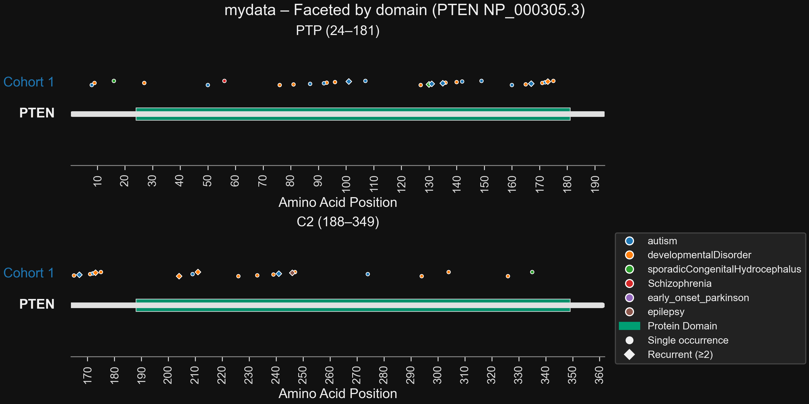

### Plot two tracks of variants (one with the function, one with the phenotype), change jitter size
```
plot-protein \
--mutations example_variants/PTEN_denovodb_version1.8_function.txt \
--mutations-name "Function" \
--mutations_bottom example_variants/PTEN_denovodb_version1.8_phenotype.txt \
--mutations-bottom-name "Phenotype"  \
-l 403 \
--jitter-window 10 \
--jitter-amplitude 0.006 \
--architecture pten_architecture.txt \
--format png \
--output PTEN_jitter_0.006.png
```
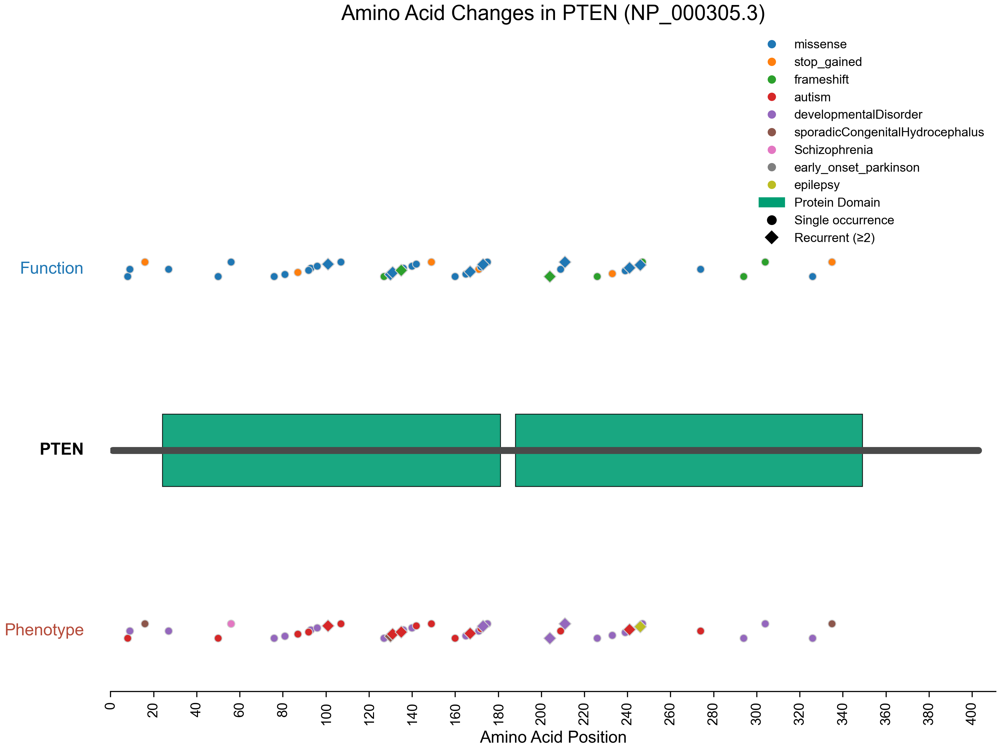

### Plot two tracks of variants (one with the function, one with the phenotype), change jitter size, dark theme
```
plot-protein \
--mutations example_variants/PTEN_denovodb_version1.8_function.txt \
--mutations-name "Function" \
--mutations_bottom example_variants/PTEN_denovodb_version1.8_phenotype.txt \
--mutations-bottom-name "Phenotype"  \
-l 403 \
--jitter-window 10 \
--jitter-amplitude 0.006 \
--architecture pten_architecture.txt \
--format png \
--output PTEN_jitter_0.006_dark.png \
--theme dark
```
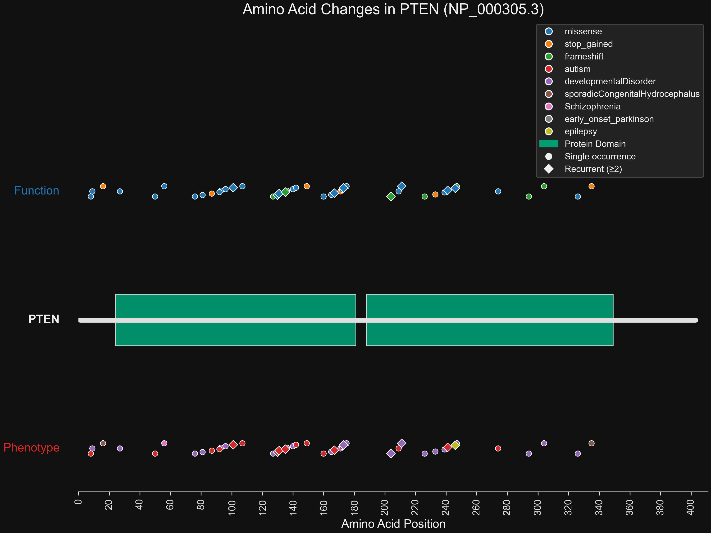

### Plot two tracks of variants (one with the function, one with the phenotype), change jitter size, dark theme, add domain labels
```
plot-protein \
--mutations example_variants/PTEN_denovodb_version1.8_function.txt \
--mutations-name "Function" \
--mutations_bottom example_variants/PTEN_denovodb_version1.8_phenotype.txt \
--mutations-bottom-name "Phenotype"  \
-l 403 \
--jitter-window 10 \
--jitter-amplitude 0.006 \
--architecture pten_architecture.txt \
--format png \
--output PTEN_jitter_0.006_dark_labels.png \
--theme dark \
--architecture-labels yes
```


### Plot two tracks of variants (one with the function, one with the phenotype), focus on domains
```
plot-protein \
--mutations example_variants/PTEN_denovodb_version1.8_function.txt \
--mutations-name "Function" \
--mutations_bottom example_variants/PTEN_denovodb_version1.8_phenotype.txt \
--mutations-bottom-name "Phenotype"  \
-l 403 \
--architecture pten_architecture.txt \
--format png \
--facet-domain \
--point-size 10  \
--output PTEN_domain_function_and_pheno.png
```
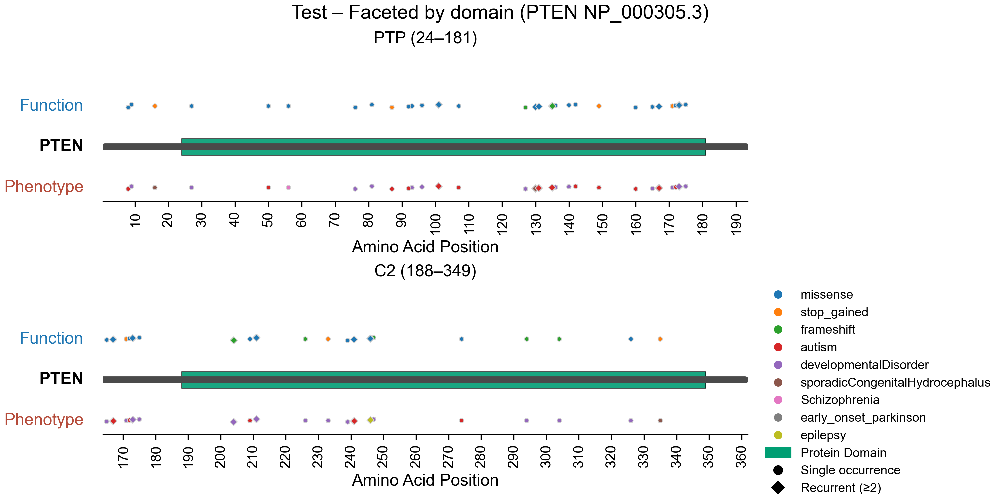

### zoom example to specific location
```
plot-protein \
--mutations example_variants/PTEN_denovodb_version1.8_function.txt \
--mutations-name "Function" \
-l 403 \
--mutations_bottom example_variants/PTEN_denovodb_version1.8_phenotype.txt \
--mutations-bottom-name "Phenotype"  \
--architecture pten_architecture.txt \
--format png \
--jitter off \
--zoom yes \
--zoomstart 120 \
--zoomend 145 \
--output PTEN_zoom_example.png
```
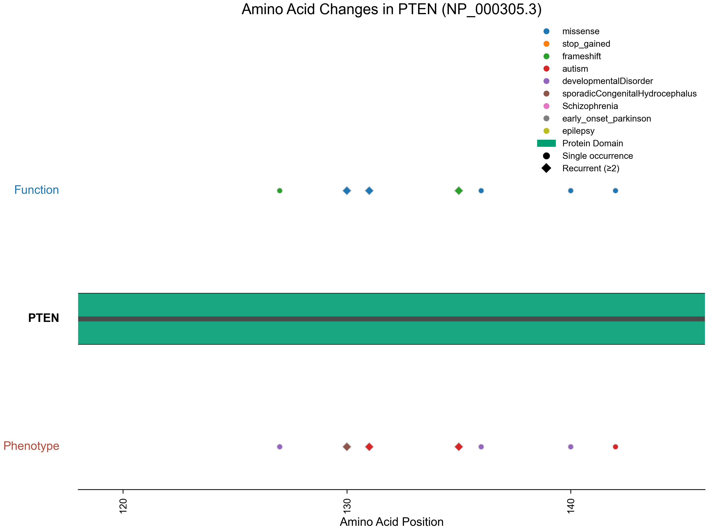

### another zoom example to specific location
```
plot-protein \
--mutations example_variants/PTEN_denovodb_version1.8_function.txt \
--mutations-name "Function" \
-l 403 \
--mutations_bottom example_variants/PTEN_denovodb_version1.8_phenotype.txt \
--mutations-bottom-name "Phenotype"  \
--architecture pten_architecture.txt \
--format png \
--jitter off \
--posttranslational pten_ptm.txt \
--zoom yes \
--zoomstart 320 \
--zoomend 350 \
--output PTEN_zoom_example2.png
```
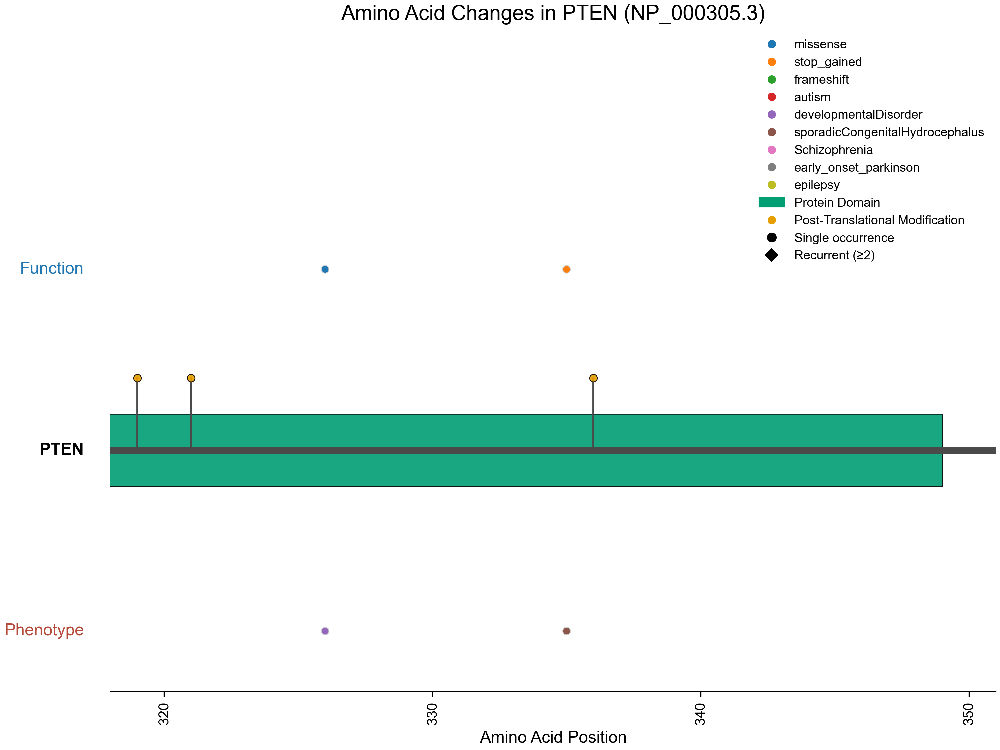
